<div align="center">

<!-- ═══════════════════════ HEADER ═══════════════════════ -->
<!-- ═══════════════════════ NAME + TITLE ═══════════════════════ -->


<br>

<!-- ═══════════════════════ TYPING INTRO ═══════════════════════ -->

<a href="https://git.io/typing-svg">
  
</a>

<br>

<!-- ═══════════════════════ PROFILE IMAGE ═══════════════════════ -->


<!-- ═══════════════════════ NEON CIRCUIT ANIMATION ═══════════════════════ -->


<br>
<br>

</div>

<!-- ═══════════════════════ ABOUT ME ═══════════════════════ -->

<div align="center">

```diff
+ Hey there! I'm Hishantik Sarkar — welcome to my corner of GitHub.
```

</div>

<table align="center">
<tr>
<td width="50%">

### About Me

- **Aspiring Software Developer** passionate about building things that matter
- Exploring **Linux**, **Cloud**, and **Open Source** ecosystems
- Gamer, anime lover, and someone who believes good code tells a story
- Currently learning, building, and breaking things in the best way

</td>
<td width="50%">

### What I Do

- Full-stack web development with **React** & **Node.js**
- Systems work across **Linux**, **Windows**, **Mac**
- Containerization & cloud with **Docker** & **AWS**
- Writing about tech on **Dev.to** & exploring new stacks

</td>
</tr>
</table>

<br>

<!-- ═══════════════════════ TECH STACK ═══════════════════════ -->

<div align="center">


<br>
<br>

<!-- Languages -->
&nbsp;
&nbsp;
&nbsp;
&nbsp;
&nbsp;
&nbsp;
&nbsp;
&nbsp;

<br>

<!-- Frameworks & Tools -->
&nbsp;
&nbsp;
&nbsp;
&nbsp;
&nbsp;
&nbsp;

<br>
<br>

<!-- Language depth chart -->


</div>

<br>

<!-- ═══════════════════════ STATS ═══════════════════════ -->

<div align="center">


<br>
<br>


<!-- Stats Cards Row -->
<!--  -->
&nbsp;
<!--  -->

<br>

<!-- TopLanguages -->


&nbsp;
</div>

<br>

<!-- ═══════════════════════ CONTRIBUTION GRAPH ═══════════════════════ -->

<div align="center">


<br>

  
<br>
  
<!--START_SECTION:activity-->

<!-- END_SECTION:activity -->

  

<br>

<!-- Contribution Calendar -->


</div>

<br>

<!-- ═══════════════════════ WAKATIME ═══════════════════════ -->

<div align="center">

<details>
<summary>
 
</summary>
<br>


<br>

<!--START_SECTION:waka-->


**I'm a Night 🦉** 

```text
🌞 Morning                209 commits         ███░░░░░░░░░░░░░░░░░░░░░░   10.59 % 
🌆 Daytime                396 commits         █████░░░░░░░░░░░░░░░░░░░░   20.06 % 
🌃 Evening                958 commits         ████████████░░░░░░░░░░░░░   48.53 % 
🌙 Night                  411 commits         █████░░░░░░░░░░░░░░░░░░░░   20.82 % 
```
📅 **I'm Most Productive on Tuesday** 

```text
Monday                   282 commits         ████░░░░░░░░░░░░░░░░░░░░░   14.29 % 
Tuesday                  396 commits         █████░░░░░░░░░░░░░░░░░░░░   20.06 % 
Wednesday                382 commits         █████░░░░░░░░░░░░░░░░░░░░   19.35 % 
Thursday                 226 commits         ███░░░░░░░░░░░░░░░░░░░░░░   11.45 % 
Friday                   205 commits         ███░░░░░░░░░░░░░░░░░░░░░░   10.39 % 
Saturday                 170 commits         ██░░░░░░░░░░░░░░░░░░░░░░░   08.61 % 
Sunday                   313 commits         ████░░░░░░░░░░░░░░░░░░░░░   15.86 % 
```


📊 **This Week I Spent My Time On** 

```text
🕑︎ Time Zone: Asia/Kolkata

💬 Programming Languages: 
No Activity Tracked This Week

🔥 Editors: 
No Activity Tracked This Week

💻 Operating System: 
No Activity Tracked This Week
```

🤖 **AI Coding This Week** 

```text
No AI Coding Activity Tracked This Week
```


<!--END_SECTION:waka-->

</details>

</div>

<br>

<!-- ═══════════════════════ BLOGS ═══════════════════════ -->

<div align="center">


<br>


<br>

<!-- BLOG-POST-LIST:START -->
| Title | Date |
| --- | --- |
| [Getting Started with gaming on linux systems.](https://hishantik.vercel.app/blog/the-complete-guide-to-linux-gaming) | Sat May 30 2026 12:00 AM |
| [My Development Journey So Far](https://hishantik.vercel.app/blog/my-dev-journey-so-far) | Thu May 28 2026 12:00 AM |
| [Understanding TypeScript Generics](https://hishantik.vercel.app/blog/understanding-typescript-generics) | Mon May 25 2026 12:00 AM |
| [A Complete Guide to Networking on Linux Systems for File and Data Sharing](https://dev.to/hishantik/a-complete-guide-to-networking-on-linux-systems-for-file-and-data-sharing-126f) | Thu May 07 2026 7:46 AM |
| [Setting Up Termux for Web Development: A Complete Guide](https://dev.to/hishantik/setting-up-termux-for-web-development-a-complete-guide-jal) | Tue Feb 11 2025 12:43 PM |
<!-- BLOG-POST-LIST:END -->

</div>

<br>

<!-- ═══════════════════════ NOW PLAYING ═══════════════════════ -->

<div align="center">


<br>
<br>


</div>

<br>

<div align="center">


<!-- ANILIST_ACTIVITY:start -->

-   📖 Read chapter 62 of [Chronicles of the Lazy Sovereign](https://anilist.co/manga/195914) (15:40 30 August 2026)
-   📖 Read chapter 157 of [The Lazy Lord Masters the Sword](https://anilist.co/manga/135325) (21:46 29 August 2026)
-   📖 Read chapter 50 of [The Patron of Villains](https://anilist.co/manga/201009) (14:28 29 August 2026)
-   📖 Read chapter 1 of [The Legendary Spearman Returns](https://anilist.co/manga/141479) (00:40 28 August 2026)
-   📖 Plans to read [The Legendary Spearman Returns](https://anilist.co/manga/141479) (00:29 28 August 2026)

<!-- ANILIST_ACTIVITY:end -->
</div>

<br>

<!-- ═══════════════════════ CONNECT ═══════════════════════ -->

<div align="center">


<br>
<br>

<a href="https://www.facebook.com/profile.php?id=100004127235868"></a>&nbsp;
<a href="https://instagram.com/dek_ustik"></a>&nbsp;
<a href="https://twitter.com/sarkar_234"></a>&nbsp;
<a href="https://dev.to/sarkar_234"></a>&nbsp;
<a href="https://stackoverflow.com/users/20044958/Hishantik-Sarkar"></a>&nbsp;
<a href="https://leetcode.com/Dekustik"></a>&nbsp;
<a href="https://hashnode.com/@Dekustik"></a>&nbsp;

</div>

<br>

<!-- ═══════════════════════ FOOTER ═══════════════════════ -->

<div align="center">


<br>


<br>
<br>

<sub>crafted with care by <b>Hishantik</b></sub>

</div>
